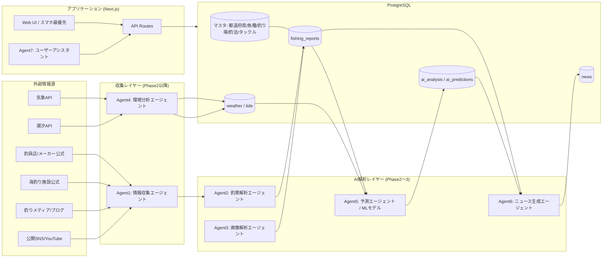

# 釣果ニュースAIアプリ — システムアーキテクチャ設計書

> このドキュメントは実装開始前に作成する設計資料(指示書 60項) です。
> MVP (指示書 45項) を最終目標に、Step 1〜4 の実装範囲を明示します。

## 0. 開発方針

- 対象地域は `prefectures` テーブルで管理し、ハードコードしない（兵庫・大阪・和歌山を `is_active=true` で初期投入、京都・奈良・滋賀・三重は `is_active=false` で将来拡張用に用意）。
- 魚種・釣法・タックル等はすべてマスタテーブルで管理し、管理画面から追加できる構造にする。
- 実測値・AI推定値・機械学習予測は常にカラム/フラグで区別し、混同しない（指示書 9, 25, 58項）。
- 架空の釣果データは一切生成しない。データが無い項目は `NULL` を許容する。

## 1. システムアーキテクチャ概要



## 2. ディレクトリ構成 (Step 1)

```
.
├── docs/
│   ├── ARCHITECTURE.md         本書
│   └── DEVELOPMENT_LOG.md      Phaseごとの実装記録
├── prisma/
│   ├── schema.prisma           DB定義 (Step 2)
│   └── seed.ts                 マスタ投入 (Step 3)
├── src/
│   ├── app/
│   │   ├── layout.tsx
│   │   ├── page.tsx             トップ画面 (51項)
│   │   ├── fishing-reports/
│   │   │   ├── page.tsx         釣果情報 一覧・検索
│   │   │   └── new/page.tsx     釣果情報 登録フォーム
│   │   ├── fish-species/page.tsx  魚種マスタ一覧
│   │   ├── fishing-spots/page.tsx 釣り場マスタ一覧
│   │   └── api/
│   │       ├── prefectures/route.ts
│   │       ├── fish-species/route.ts
│   │       ├── fishing-methods/route.ts
│   │       ├── fishing-spots/route.ts
│   │       ├── sources/route.ts
│   │       └── fishing-reports/route.ts / [id]/route.ts
│   ├── components/              UIコンポーネント
│   ├── lib/
│   │   ├── prisma.ts             Prisma Client シングルトン
│   │   └── validation.ts         zodスキーマ (入力値検証)
│   └── types/
├── .env.example
├── package.json
├── tsconfig.json
├── tailwind.config.ts
└── next.config.mjs
```

将来のPhaseで `src/lib/agents/`（AIエージェント群）、`src/lib/ml/`（機械学習パイプライン）、`src/app/admin/`（管理画面）、`src/app/api/predictions/`, `src/app/api/chat/` 等を追加する。

## 3. DB ER図 (Step 2, 指示書 35〜38項)

```mermaid
erDiagram
    prefectures ||--o{ cities : has
    prefectures ||--o{ fishing_spots : has
    cities ||--o{ fishing_spots : has
    fishing_spots ||--o{ fishing_reports : "reported at"
    fish_species ||--o{ fishing_reports : "caught species"
    fishing_methods ||--o{ fishing_reports : "method used"
    baits ||--o{ fishing_reports : used
    lures ||--o{ fishing_reports : used
    rods ||--o{ fishing_reports : used
    reels ||--o{ fishing_reports : used
    sources ||--o{ fishing_reports : "sourced from"
    fishing_reports ||--o{ images : has
    fishing_reports ||--o{ ai_analysis : "analyzed by"
    fishing_spots ||--o{ weather : "observed at"
    fishing_spots ||--o{ tide : "observed at"
    fish_species ||--o{ ai_predictions : "predicted for"
    fishing_spots ||--o{ ai_predictions : "predicted for"
    users ||--o{ user_fishing_logs : posts
    users ||--o{ notifications : receives

    prefectures {
      int id PK
      string name
      string name_kana
      boolean is_active
    }
    cities {
      int id PK
      int prefecture_id FK
      string name
    }
    fishing_spots {
      int id PK
      int prefecture_id FK
      int city_id FK
      string name
      decimal latitude
      decimal longitude
      string spot_type
      boolean is_active
    }
    fish_species {
      int id PK
      string name
      string name_kana
      string category
      boolean is_active
    }
    fishing_methods {
      int id PK
      string name
      string description
    }
    sources {
      int id PK
      string name
      string url
      string source_type
      string fetch_method
      boolean fetch_allowed
      int trust_score
      timestamp last_fetched_at
      string last_error
      boolean is_active
    }
    fishing_reports {
      int id PK
      int source_id FK
      string source_url
      timestamp published_at
      timestamp fishing_date
      int prefecture_id FK
      int city_id FK
      int fishing_spot_id FK
      int fish_species_id FK
      int catch_count
      decimal min_size
      decimal max_size
      decimal average_size
      string size_unit
      string size_estimation_method "TEXT | IMAGE_AI | UNKNOWN"
      int fishing_method_id FK
      string bait_raw
      int bait_id FK
      string lure_raw
      int lure_id FK
      int rod_id FK
      int reel_id FK
      string line_raw
      string leader_raw
      string tackle_raw_text
      string original_text
      string time_of_day
      decimal confidence_score
      boolean is_duplicate
      int duplicate_of_id FK
      timestamp created_at
      timestamp updated_at
    }
    baits { int id PK, string name, string category }
    lures { int id PK, string maker, string name, string lure_type }
    rods { int id PK, string maker, string name, string length, string action }
    reels { int id PK, string maker, string name, string size }
    images {
      int id PK
      int fishing_report_id FK
      string url
      string license_note
      timestamp created_at
    }
    ai_analysis {
      int id PK
      int fishing_report_id FK
      string model_name
      string model_version
      json input
      json output
      decimal confidence
      timestamp executed_at
    }
    ai_predictions {
      int id PK
      int fish_species_id FK
      int fishing_spot_id FK
      date target_date
      int expectation_score
      json basis
      string model_name
      string model_version
      timestamp created_at
    }
    weather {
      int id PK
      int fishing_spot_id FK
      timestamp observed_at
      decimal temperature
      decimal water_temperature
      decimal precipitation
      string condition
      decimal wind_speed
      string wind_direction
      decimal wave_height
    }
    tide {
      int id PK
      int fishing_spot_id FK
      date date
      string tide_type
      json high_tide_times
      json low_tide_times
      int moon_age
    }
    news {
      int id PK
      date news_date
      string title
      text body_markdown
      json highlights
      timestamp published_at
    }
    users {
      int id PK
      string email
      string display_name
      timestamp created_at
    }
    notifications {
      int id PK
      int user_id FK
      string type
      string message
      boolean is_read
      timestamp created_at
    }
    user_fishing_logs {
      int id PK
      int user_id FK
      timestamp fishing_date
      int fishing_spot_id FK
      int fish_species_id FK
      int catch_count
      decimal size
      string comment
      decimal trust_score
      timestamp created_at
    }
```

Step 1〜4 では `prefectures, cities, fishing_spots, fish_species, fishing_methods, baits, lures, rods, reels, sources, fishing_reports, images` を実装対象とする。`ai_analysis, ai_predictions, weather, tide, news, notifications, users, user_fishing_logs` はスキーマとして定義するが、機能実装はPhase2以降。

## 4. API一覧 (Step 1〜4 時点)

| Method | Path | 説明 |
|---|---|---|
| GET | `/api/prefectures` | 都道府県マスタ取得（`is_active`のみ or 全件） |
| GET | `/api/fish-species` | 魚種マスタ取得（検索・カテゴリ絞込） |
| GET | `/api/fishing-methods` | 釣法マスタ取得 |
| GET | `/api/fishing-spots` | 釣り場マスタ取得（都道府県絞込） |
| GET | `/api/sources` | 情報源一覧取得 |
| GET | `/api/fishing-reports` | 釣果情報一覧取得（魚種/釣り場/期間で絞込） |
| POST | `/api/fishing-reports` | 釣果情報登録（原文・情報源URL必須、事実項目のみ） |
| GET | `/api/fishing-reports/:id` | 釣果情報詳細取得 |

Phase2以降で `/api/predictions`, `/api/news`, `/api/chat`, `/api/admin/*`, `/api/images/analyze` 等を追加。

## 5. 画面一覧

### Step 1〜4 (MVP初期スライス)
- `/` トップ画面（現状はプレースホルダ表示。データ蓄積後に51項の内容を表示）
- `/fishing-reports` 釣果情報一覧・検索
- `/fishing-reports/new` 釣果情報登録フォーム
- `/fish-species` 魚種マスタ一覧
- `/fishing-spots` 釣り場マスタ一覧

### Phase2以降
- 魚種詳細画面 (52項) / 釣り場詳細画面 (53項)
- 今日のおすすめ画面 (51項)
- 地図・ヒートマップ (27, 28項)
- AIチャット画面 (26項)
- 管理者画面 (33項)

## 6. AIエージェント構成 (24項, Phase2〜4で段階導入)

| Agent | 役割 | 導入Phase |
|---|---|---|
| Agent1 情報収集 | 情報源巡回・取得 | Phase2 |
| Agent2 釣果解析 | 原文→構造化データ抽出 | Phase2 |
| Agent3 画像解析 | 魚種・個体数・サイズ推定 | Phase2 |
| Agent4 環境分析 | 天候・潮汐・季節分析 | Phase2 |
| Agent5 予測 | MLモデルによる期待度算出 | Phase3 |
| Agent6 ニュース生成 | 構造化データから日次ニュース生成 | Phase3 |
| Agent7 ユーザーアシスタント | 自然言語質問への回答 | Phase3〜4 |

各エージェントの出力は必ず `ai_analysis` / `ai_predictions` テーブルにモデル名・バージョン・入出力・信頼度とともに保存し、原文・実測値と区別する。

## 7. データ収集フロー (Phase2, 39項)

```
毎日05:00 バッチ
1. sources を巡回（利用規約・robots.txt遵守、許可された取得方法のみ）
2. 新着釣果を取得
3. 重複判定 (fishing_date/spot/species/catch_count/類似度)
4. Agent2で構造化解析 → fishing_reports + ai_analysis
5. 画像があればAgent3でサイズ・魚種推定
6. weather / tide を取得し紐付け
7. 前日比・週間比較を集計
8. Agent5で釣果期待度ランキング算出
9. Agent6で日次ニュース生成
10. 公開・通知送信
失敗時: ログを残し、該当ステップのみスキップして継続（44項のフェイルセーフ方針）
```

## 8. 機械学習パイプライン (Phase3, 20〜23, 56項)

```
fishing_reports + weather + tide  →  特徴量エンジニアリング
  →  学習 (scikit-learn / LightGBM)
  →  fish_species × fishing_spot × date の期待度予測
  →  ai_predictions に保存 (モデル名/バージョン付き)
  →  実釣果と突き合わせて Precision/Recall/F1/MAE/RMSE を記録
  →  モデル再学習・バージョン更新
```

初期特徴量: 都道府県/釣り場/魚種/月/季節/曜日/時間帯/気温/水温/風速風向/降水量/波高/潮回り/潮位/月齢/天候/釣法/餌/ルアー重量/ジグヘッド重量/直近7日・30日釣果。

## 9. 環境変数一覧

`.env.example` を参照。Step1〜4時点で必要なもの:

| 変数名 | 用途 |
|---|---|
| `DATABASE_URL` | PostgreSQL接続文字列 |
| `NEXT_PUBLIC_APP_NAME` | アプリ表示名 |

Phase2以降で追加予定: `WEATHER_API_KEY`, `TIDE_API_KEY`, `LLM_API_KEY`, `MAPS_API_KEY`, `CRON_SECRET`, `NEXTAUTH_SECRET` 等。APIキーはフロントエンドへ露出させない（42項）。
